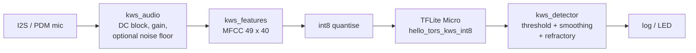

# Hello Tors — Keyword Spotting on ESP32-S3

A small wake-word model ("Hello Tors") with a complete ESP32-S3
deployment package: ESP-IDF firmware, a portable C MFCC front end, and Python reference tools.

## Repository layout

- `deploy_esp32s3/` — everything needed to run the int8 TFLite model on an ESP32-S3
  - `firmware/hello_tors_kws/` — ESP-IDF project (build + flash this)
  - `export/` — `hello_tors_kws_int8.tflite`, `feature_config.json`, `training_report.txt`, `per_file_test.csv`
  - `scan_audio.py` — Python reference: scan a WAV file
  - `mic_kws.py` — Python reference: live mic on a PC
  - `tools/` — firmware table generator, C-vs-Python feature verifier, PC test harness
  - `test_audio/` — test recordings and boot self-test clips
  - `README.md` — **full build, wiring, calibration and tuning guide (start here)**

## Pipeline



## Model and features

- Audio: 16 kHz mono, 15840-sample window (0.99 s) → 49 frames
- Framing: 480-sample frame, 320-sample step (20 ms), Hann window, 512-point FFT (magnitude)
- Mel: 40 bands, 20–8000 Hz (HTK), log with 1e-6 epsilon, 40 MFCCs
- Model: int8 TFLite, 36,744 bytes; output index 1 = P("Hello Tors")
- Firmware defaults: threshold 0.5, smoothing 2 consecutive windows, refractory 1000 ms

## Quick start

```bash
# Python reference (see deploy_esp32s3/requirements.txt)
cd deploy_esp32s3
pip install -r requirements.txt
python scan_audio.py test_audio/Naman_Close_clean.wav --threshold 0.5 --smooth 2

# Firmware (ESP-IDF v5.3 or newer)
cd firmware/hello_tors_kws
idf.py set-target esp32s3
idf.py build
idf.py -p <PORT> flash monitor
```

Edit `deploy_esp32s3/firmware/hello_tors_kws/main/kws_config.h` first (mic type, I2S pins, gain, threshold, LED).

## Results and status

- Held-out speakers at threshold 0.85: TPR 43.3 %, false activation rate 0 % (`export/training_report.txt`)
- On PC with threshold 0.5 + 2-window smoothing: 10/10 on `Naman_Close_clean.wav`, 0 false
- C front end verified against TensorFlow: 1960/1960 self-test int8 inputs identical
- The model is level-sensitive; mic gain calibration is required (see the deploy README, section 4)
- **Not yet compiled with ESP-IDF or run on a board** — the first `idf.py build` and the boot self-test are the real test
